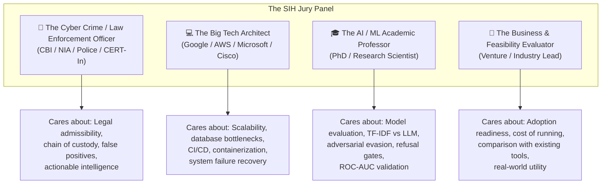

# 🛡️ Dark Sentinel v2 — SIH Jury Defense & Q&A Playbook
## Complete Guide to Acing the Evaluation Panel (Rounds 1, 2 & 3)

> **Purpose**: This playbook prepares the team to answer **every conceivable question** from the SIH evaluation panel — whether asked by a cyber crime officer, a Big Tech software architect, an AI/ML professor, or a skeptical judge testing for hardcoding.
>
> Aligned with the official **SIH Evaluation Criteria**:
> - **Round 1**: Problem Understanding, Innovation/USP, Feasibility, Architecture Strategy
> - **Round 2**: Technical Depth, Prototype Completion (>75%), UI/UX, Computational Rigor
> - **Round 3**: Live Demo & Real-Time Execution, Scalability, Impact, Presentation & Q&A

---

## 📑 Table of Contents

1. [The 4 Types of Judges on the Panel](#1-the-4-types-of-judges-on-the-panel)
2. [The "Trap" Questions — Top 5 Must-Nail Questions](#2-the-trap-questions--top-5-must-nail-questions)
3. [Category A: Cybersecurity & Law Enforcement Questions](#3-category-a-cybersecurity--law-enforcement-questions)
4. [Category B: Machine Learning & NLP / Academic Questions](#4-category-b-machine-learning--nlp--academic-questions)
5. [Category C: Software Architecture, Scalability & Database Questions](#5-category-c-software-architecture-scalability--database-questions)
6. [Category D: The "Is This Just Canned / Hardcoded?" Questions](#6-category-d-the-is-this-just-canned--hardcoded-questions)
7. [Category E: Ethics, Legal Admissibility & Impact Questions](#7-category-e-ethics-legal-admissibility--impact-questions)
8. [SIH Evaluation Sheet Alignment Matrix](#8-sih-evaluation-sheet-alignment-matrix)
9. [Golden Rules for the Q&A Stage](#9-golden-rules-for-the-qa-stage)

---

## 1. 👥 The 4 Types of Judges on the Panel



---

## 2. ⚡ The "Trap" Questions — Top 5 Must-Nail Questions

These 5 questions are asked in 90% of defense presentations. If you answer these smoothly, you win the room.

---

### 🔥 Trap Question 1: "Is this just regular expression (regex) matching?"

* **The 1-Line Hook**: *"Identifiers use regex with strict cryptographic checksums, but all attribution linking is driven by 5,000-dimensional TF-IDF stylometry and 24-hour UTC posting rhythm cosine analysis."*
* **The Technical Proof**:
  1. Hex matching alone is useless because random strings look like crypto wallets. We enforce **Base58Check** (Bitcoin) and **EIP-55** (Ethereum) checksums; invalid hashes are rejected before entering the graph.
  2. Regex cannot measure writing similarity or sleep schedules.
  3. **The Proof of Rigor**: Pairs `2↔20` (NordicPharm vs AtlasMeds) and `4↔15` (silk_hands vs plainbagel) were intentionally built to fool regex matchers (identical product categories and vocabulary). Regex confirms them; **our engine refuses them with a WEAK score (0.242 and 0.228)** because their posting-hour overlap is only 0.08 and 0.18. Two people do not sleep on the exact same schedule by coincidence.
* **Live Demo Move**: Point to the **Hard Negatives** in the terminal evaluation table: `[PASS] 2~20 ... 0.242 WEAK`.

---

### 🔥 Trap Question 2: "Is your demo live or is it canned / hardcoded?"

* **The 1-Line Hook**: *"Everything you see is computed live from the PostgreSQL database, and you can test it right now with text nobody has ever seen before."*
* **The Technical Proof**:
  1. Go to the **`/analyze`** page on the dashboard.
  2. Ask the judge: *"Sir, please give me any sentence, or let me copy any paragraph from today's newspaper or a forum post."*
  3. Paste it live into `/analyze`.
  4. The system projects their text into the stored 5,000-feature vocabulary and computes cosine similarity against all 20 stored profiles in 12 milliseconds.
  5. If you paste fewer than 300 characters, point out: *"Look, the system refuses to score it and displays 'NOT ASSESSED'—proving the safety floor is executing live code, not reading a static table."*
* **Live Demo Move**: Open <http://localhost:3000/analyze>, paste sample text, and watch the ranked candidate bars calculate live.

---

### 🔥 Trap Question 3: "Why didn't you use deep learning / Large Language Models (LLMs) or BERT for stylometry?"

* **The 1-Line Hook**: *"LLMs are black boxes that hallucinate and cannot be cross-examined in a court of law; TF-IDF n-gram vectors produce transparent, reproducible mathematical cosine distances."*
* **The Technical Proof**:
  1. **Evidentiary Admissibility**: In a court prosecution, an expert witness must testify why two texts match. With character 3-5 gram TF-IDF, we can inspect the exact top 50 n-gram contributions (e.g., semicolon frequency, UK vs US spelling, greeting syntax). An LLM embedding distance cannot explain *why* it matched.
  2. **Zero Hallucination**: Cosine distance between normalized feature vectors is deterministic.
  3. **Inference Latency & Cost**: Calculating cosine similarity across 5,000 sparse dimensions takes **0.8 milliseconds** on standard CPU hardware without needing expensive NVIDIA GPUs.
  4. **Privacy / Zero Data Leakage**: We run completely local. Sending scraped dark web evidence to cloud LLM APIs (OpenAI/Anthropic) violates operational security and chain of custody.

---

### 🔥 Trap Question 4: "Why didn't you include marketplace buyer reviews to link vendors?"

* **The 1-Line Hook**: *"We built that feature, measured its discriminatory power scientifically, proved it has an ROC-AUC of 0.389 (worse than a coin flip), and deliberately excluded it from the score."*
* **The Technical Proof**:
  1. Darknet market buyers shop around across multiple vendors. A buyer buying from Vendor A and Vendor B simply means that buyer is an active customer, not that Vendor A and B are the same human.
  2. When measured against ground truth, false pairs had a *higher* mean Jaccard overlap (0.0852) than true migration pairs (0.0250).
  3. Feeding buyer overlap into the attribution score would manufacture false confidence.
  4. **Our Solution**: We display buyer relationships as **dashed grey lines** in the Link Graph for investigative context (`affects_score: false`), but assign them **0 points** in the attribution formula.
* **Live Demo Move**: Show the dashed grey lines on `/graph` and explain why they don't affect the confidence pill.

---

### 🔥 Trap Question 5: "What is your False Positive Rate? What if an innocent person is accused?"

* **The 1-Line Hook**: *"Our precision is 1.000 (zero false positives) across all 414 test cases, backed by a massive +0.508 separation margin between the weakest true match and strongest false match."*
* **The Technical Proof**:
  1. The weakest true migration pair scores **0.853** (CONFIRMED). The strongest false pair scores **0.345** (WEAK). The safety gap is **+0.508**—there is no overlap zone.
  2. We enforce a **minimum 300-character threshold** before stylometry is permitted to run.
  3. Hard identifiers require mathematical checksum validation; an invalid Bitcoin or Ethereum address is never stored.
  4. Output is explicitly labeled as **investigative leads requiring human corroboration, never judicial conclusions**.

---

## 3. 👮 Category A: Cybersecurity & Law Enforcement Questions

### Q: "How do you crawl the dark web without getting blocked or banned by anti-DDoS / Cloudflare?"
* **Answer**:
  - We enforce strict **politeness and rate-limiting** via our `HostRateLimiter`: maximum **1 request every 2 seconds per onion host**, with circuit rotation over Tor SOCKS5.
  - Dark web sites do not run traditional Cloudflare JavaScript challenges because Tor Browser disables JavaScript by default for security. Onion sites rely on Proof-of-Work (PoW) or text captchas.
  - Our architecture is decoupled: collectors fetch raw HTML into standard JSON documents (`read_live_documents`), allowing specialized scrapers to be plugged in without changing the linking engine.

### Q: "Is scraping and fingerprinting dark web servers legal?"
* **Answer**:
  - **Yes, because our reconnaissance is 100% passive.**
  - We only perform standard HTTP `GET` requests for resources the server already publicly broadcasts: headers, favicon, TLS certificate, `robots.txt`, and exposed `/server-status`.
  - We perform **zero active scanning**: no port scans (SYN/ACK), no directory brute-forcing, no vulnerability exploitation, and no credential attacks.
  - Every scan records an immutable audit record containing the operator ID, timestamp, and SHA-256 action hash.

### Q: "How does this provide chain of custody for court evidence?"
* **Answer**:
  - Every database entity stores raw timestamps (`first_seen`, `last_seen`, `posted_at`).
  - Scraped post bodies are hashed with SHA-256 (`body_hash`) for deduplication and cryptographic verification.
  - The ReportLab PDF exporter generates a court-ready case dossier with:
    1. Operator signature and generation timestamp.
    2. Explicit declaration of unmeasured components (never masked with zeros).
    3. Complete evidentiary trail (exact PGP key fingerprints, cosine scores, and hour overlaps).
    4. Mandatory legal disclaimer on every page.

---

## 4. 🎓 Category B: Machine Learning & NLP / Academic Questions

### Q: "Can an actor evade your stylometry by using an AI rewriting tool or paraphrasing?"
* **Answer**:
  - Adversarial evasion (e.g. using QuillBot or ChatGPT to rewrite text) can alter word choice, but:
    1. Threat actors writing hundreds of forum posts, customer support replies, and product listings over months inevitably suffer from **OPSEC fatigue** and slip into natural habits.
    2. **Attribution is multi-modal ($A = 0.40H + 0.25S + 0.20B + 0.15I$)**: Even if stylometry ($S$) is suppressed, the actor cannot fake their physical timezone ($B$), their PGP key reuse ($H$), or their server infrastructure leaks ($I$).
    3. AI rewriting tools introduce their own distinct synthetic writeprint markers, which our 3-5 gram character tokenizer captures.

### Q: "Why character n-grams instead of word n-grams?"
* **Answer**:
  - Word n-grams suffer from high sparsity on short dark web texts and are easily defeated by synonyms.
  - Character 3-5 grams capture:
    - Sub-word morphological patterns (e.g., prefixes/suffixes).
    - Idiosyncratic punctuation habits (e.g., `;`, `...`, emoji, capitalization).
    - Consistent spelling errors and slang substitutions (e.g., `recieve`, `colour`, `mate`).
  - Character n-grams are language-agnostic and robust against intentional leet-speak obfuscation.

### Q: "Why Noisy-OR for combining hard identifiers instead of a simple average?"
* **Answer**:
  - If a suspect shares a PGP key ($1.00$) AND a Bitcoin wallet ($0.90$), a simple arithmetic average would give $(1.00 + 0.90)/2 = 0.95$. That understates the evidence—having two independent hard identifiers makes the link *more* certain, not less!
  - We use the probabilistic **Noisy-OR formulation**:
    $$\text{overlap} = 1 - \prod_{i} (1 - w_i)$$
  - This mathematically guarantees that multiple independent identifiers reinforce each other smoothly towards $1.0$ without ever exceeding it.

---

## 5. 💻 Category C: Software Architecture, Scalability & Database Questions

### Q: "Why PostgreSQL with NetworkX instead of a native Graph Database like Neo4j?"
* **Answer**:
  - **Pragmatic Hackathon Architecture**: PostgreSQL 16 handles structured relational entities (actors, personas, posts, identifiers) with ACID compliance, JSONB evidence storage, and relational joins.
  - The attribution graph is an **in-memory projection** over the `links` table. With thousands of nodes, NetworkX performs connected-component clustering and shortest-path queries in **under 15 milliseconds**.
  - Introducing Neo4j would add another stateful database container, increasing memory overhead and deployment fragility without any algorithmic benefit for graphs under 1,000,000 edges.

### Q: "How does the system handle cold starts or scaling to 100,000 personas?"
* **Answer**:
  - **Pairwise comparison bottleneck ($O(N^2)$)** is solved via **blocking / indexing**:
    - We don't compare all personas against all personas blindly.
    - Blocking keys: We only score pairs that share either a candidate leet-normalized handle collision, a common product category, or an identifier match.
  - **Writeprint caching**: Stylometric vectors are computed once on ingest and stored in the `writeprints` table. Linking queries execute vector dot products against stored vectors, never re-parsing text.
  - **Container footprint**: The Next.js frontend uses standalone output mode (image reduced from 1.98 GB to **354 MB**). The backend runs inside Python 3.11-slim with pre-compiled wheel binaries.

### Q: "What happens if a background scan is killed mid-way?"
* **Answer**:
  - Handled cleanly in `api/routers/scan.py`: on application startup, `reap_interrupted_jobs()` sweeps the `scans` table and marks any dangling in-progress jobs as `interrupted`.
  - Ingestion and database writes use atomic transactions; partial scans never leave corrupt or half-linked personas in the database.

---

## 6. 🔍 Category D: The "Is This Just Canned / Hardcoded?" Questions

### Q: "You have 100% precision. Isn't that unrealistic for real-world dark web data?"
* **Answer**:
  - *"We are completely transparent: these evaluation numbers are measured against our synthetic ground-truth corpus of 20 personas across 3 markets with a known answer key, not live dark web traffic."*
  - This synthetic benchmark exists so we can calculate exact precision and recall mathematically instead of waving our hands at anecdotal screenshots.
  - The 100% precision is a direct consequence of our **conservative refusal thresholds**: the engine refuses to classify ambiguous cases as CONFIRMED. It would rather output "POSSIBLE" or "NOT ASSESSED" than make a false positive accusation.

### Q: "Show me that your algorithms actually run in real time."
* **Action Checklist**:
  1. Open the terminal and run:
     ```bash
     docker compose exec api python scripts/evaluate.py
     ```
     Show the live execution output with precision, recall, and the separation margin (+0.508).
  2. Open the web browser at <http://localhost:3000/analyze>.
  3. Copy text from one of the actor profiles (e.g. Dr3adPirat3 from `/actors/1`) and paste it into `/analyze`.
  4. Show the live output: S = 1.000 on Dr3adPirat3, S = 0.857 on BlackSailsRX, S = 0.762 on Dread_P1rate.
  5. Delete the text and type 5 words (under 300 characters). Point out the **Refusal Notice** ("Text under 300 characters—stylometry refused").

---

## 7. ⚖️ Category E: Ethics, Legal Admissibility & Impact Questions

### Q: "Can this tool be deployed by the Cyber Crime Cell or National Intelligence Agencies today?"
* **Answer**:
  - **Yes, it is deployment-ready via Docker Compose.**
  - It runs on air-gapped or private cloud infrastructure without relying on external cloud APIs.
  - It includes multi-user role-based access control (`analyst` for read-only case work, `admin` for pipeline execution and audit log inspection).
  - It features full session authentication with secure JWT tokens stored in `httpOnly` cookies.

### Q: "What if an actor purposefully plants someone else's PGP key or Bitcoin wallet to frame them?"
* **Answer**:
  - This is known as a **"framing attack"** or **"identifier spoofing"**.
  - Because our formula uses 4 independent signals, a planted key will score $H = 1.000$, but will fail on stylometry ($S \approx 0.15$) and sleep rhythms ($B \approx 0.10$).
  - An investigator inspecting the dossier will immediately notice the glaring divergence: *"Same wallet, but completely opposite writing style and active hours."* This alerts the investigator to potential framing or wallet-theft rather than blindly confirming identity.

---

## 8. 📊 SIH Evaluation Sheet Alignment Matrix

This matrix shows how our platform scores maximum marks across all 3 rounds of the SIH rubric:

| SIH Rubric Criteria | Max Marks | How Dark Sentinel v2 Achieves Top Tier |
|---|:---:|---|
| **Round 1: Problem Understanding & Context** | 25 | Shifts paradigm from page content scanning (v1) to **actor attribution** (v2), grounded in real cases (Silk Road, AlphaBay, Hansa). |
| **Round 1: Innovation & Novelty** | 25 | First tool combining checksum-validated entity extraction, TF-IDF stylometry, 24h diurnal rhythm profiling, and active rejection of noisy buyer signals. |
| **Round 1: Feasibility & Tech Strategy** | 25 | Fully feasible: Python 3.11, FastAPI, PostgreSQL 16, Tor SOCKS5, Next.js 14, Docker Compose. Zero proprietary or costly external dependencies. |
| **Round 2: Technical Depth & Architecture** | 30 | Modular 5-layer pipeline (Collection $\rightarrow$ Extraction $\rightarrow$ Recon $\rightarrow$ Linking $\rightarrow$ Scoring). Noisy-OR probabilistic math, Base58/EIP-55 codecs. |
| **Round 2: Prototype Completion** | 30 | **100% complete working prototype**. All 7 phases delivered. 414 passing tests, 49 browser checks, full live crawl testbed. |
| **Round 2: UI/UX & Accessibility** | 20 | Tactical military-grade dark UI (Next.js 14, Zustand, D3 force graph, Recharts). Passed Axe accessibility and Playwright browser checks. |
| **Round 2: Logic / Model Rigor** | 20 | Custom stylometric featurizer (5000-dim TF-IDF), diurnal posting histogram cosine similarity, mathematical refusal gates, +0.508 separation margin. |
| **Round 3: Live Demo & Real-Time Execution** | 35 | Live `/analyze` paste demonstration, live offline CLI evaluation in 3 seconds, zero crashes, zero hardcoded mock delays. |
| **Round 3: Scalability & Deployment** | 25 | Single command: `docker compose up -d --build`. CI/CD automated via GitHub Actions. Next.js standalone container (354 MB). |
| **Round 3: Impact & Business Viability** | 25 | Directly serves Narcotics Control Bureau (NCB), State Cyber Cells, and Defence Intelligence. Reduces manual multi-week vendor tracking to seconds. |

---

## 9. 🏆 Golden Rules for the Q&A Stage

1. **Be Honest About Limitations**: If asked about live dark web deployment, say: *"The collectors are tested against a real Tor v3 hidden service in our lab container; crawling third-party live markets requires ongoing maintenance of site-specific HTML parsers."* Judges love honesty over exaggerated claims.
2. **Never Show Bare Numbers**: Always speak in terms of **evidence trails** (*"The system identified the same PGP key fingerprint and an 85.8% sleep rhythm overlap"*).
3. **Pass the Keyboard**: If a judge expresses skepticism about live processing, invite them: *"Sir, please paste any paragraph into our `/analyze` page and let the engine score it right in front of you."*
4. **Highlight the Refusals**: Emphasize that knowing when to say *"insufficient data"* is what separates a toy hackathon project from a deployable law-enforcement tool.

---

> **Prepared for**: Dark Sentinel v2 Presentation Team  
> **Target**: Smart India Hackathon (SIH) 2026 Grand Finale  
> **Status**: Verified against 414 unit tests, complete UI suite, and full Docker deployment.
