# 🛡️ Dark Sentinel v2 — Project Documentation

## Finding the People Behind the Masks on the Dark Web

> **Last Updated**: September 2026 — All 7 phases complete. **414 tests passing.** Full-stack deployment via Docker Compose.

---

## 📖 Table of Contents

1. [What Is This Project?](#1--what-is-this-project)
2. [Why Does This Matter? — Real Cases](#2--why-does-this-matter--real-cases)
3. [How Does the Dark Web Work?](#3--how-does-the-dark-web-work)
4. [What Changed from Version 1?](#4--what-changed-from-version-1)
5. [How It Works — The Five Layers](#5--how-it-works--the-five-layers)
6. [The Four Clues We Look For](#6--the-four-clues-we-look-for)
7. [How We Calculate a Confidence Score](#7--how-we-calculate-a-confidence-score)
8. [A Worked Example — Catching a Rebranded Vendor](#8--a-worked-example--catching-a-rebranded-vendor)
9. [The Live Paste Feature — "Prove It's Not Canned"](#9--the-live-paste-feature--prove-its-not-canned)
10. [The Buyer Trust Analysis — And Why We Don't Use It](#10--the-buyer-trust-analysis--and-why-we-dont-use-it)
11. [Safety Measures & Ethical Guardrails](#11--safety-measures--ethical-guardrails)
12. [The Complete System — Everything That's Built](#12--the-complete-system--everything-thats-built)
13. [How the Dashboard Looks](#13--how-the-dashboard-looks)
14. [One-Command Deployment](#14--one-command-deployment)
15. [How Accurate Is It?](#15--how-accurate-is-it)
16. [Tech Stack at a Glance](#16--tech-stack-at-a-glance)
17. [Glossary — Terms in Plain English](#17--glossary--terms-in-plain-english)

---

## 1. 🎯 What Is This Project?

### The One-Line Answer

> **Dark Sentinel v2 finds the real person behind anonymous dark web accounts — even when they change their name, move to a different website, or try to hide.**

### The Detective Analogy

Imagine a detective investigating a string of burglaries across different cities. The burglar uses a different alias in each city, wears different disguises, and works with different fences. But the detective notices patterns:

- The burglar always uses the **same lock-picking tools** (like reusing a cryptographic key)
- The burglar always **writes ransom notes with the same peculiar grammar** (like writing style analysis)
- The burglar always **works between 2 AM and 6 AM** (like posting-time patterns)
- The burglar accidentally left a **home address on a receipt at one crime scene** (like a server misconfiguration leaking a real IP address)

**Dark Sentinel v2 is that detective, but for the internet's dark web.** It collects these digital "fingerprints" from anonymous accounts across multiple dark web sites and figures out which accounts belong to the same real person.

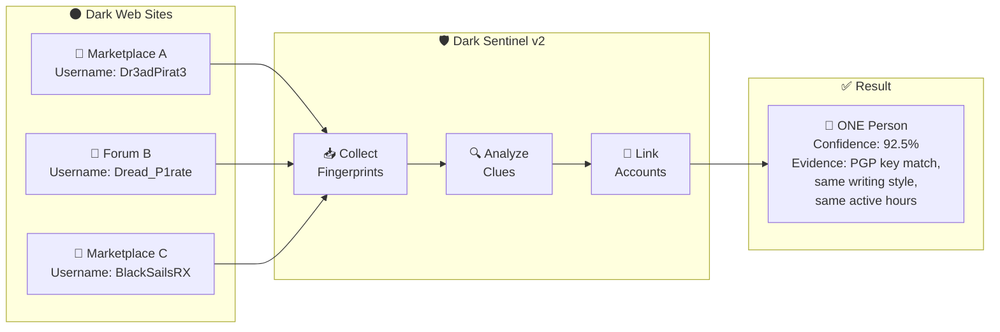

---

## 2. 🔍 Why Does This Matter? — Real Cases

Criminals on the dark web believe they are invisible behind the Tor network. History has proven them wrong — not because Tor's technology failed, but because **humans make mistakes**.

### 🏴‍☠️ Case 1: Silk Road — The Biggest Online Black Market

**Criminal**: Ross Ulbricht, operating as "Dread Pirate Roberts"

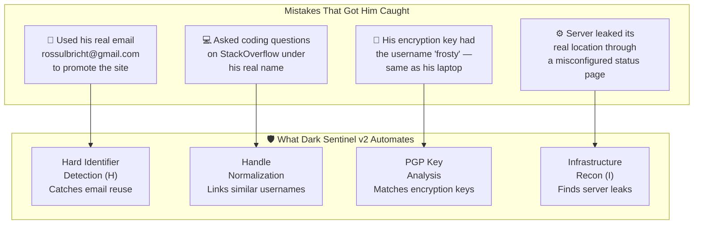

### 🏴 Case 2: AlphaBay — The Silk Road's Successor

**Criminal**: Alexandre Cazes, operating as "Alpha02"

| Mistake He Made | How Dark Sentinel v2 Catches This |
|---|---|
| Server welcome emails contained his personal email `pimp_alex_91@hotmail.com` | **Email extraction** from all collected text |
| Used the same username "Alpha02" on regular web forums and dark web sites | **Handle matching** across platforms |
| Received cryptocurrency payments to wallets linked to his real identity | **Wallet address tracking** with mathematical verification |

### 🏴 Case 3: Hansa Market & Others

When one marketplace gets shut down, vendors **migrate** to a new one under a new name. This is exactly what Dark Sentinel v2 is designed to detect — the same person appearing under different names on different sites.

---

## 3. 🌐 How Does the Dark Web Work?

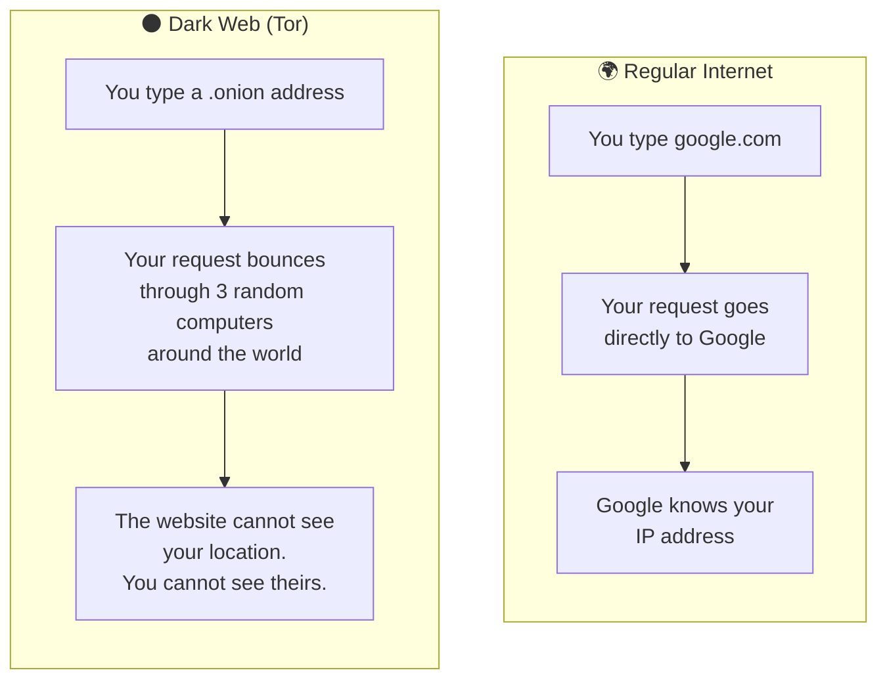

> **Key Insight**: The Tor network hides *where* you are, but it cannot hide *who* you are if you leave clues in what you write and share.

---

## 4. 🔄 What Changed from Version 1?

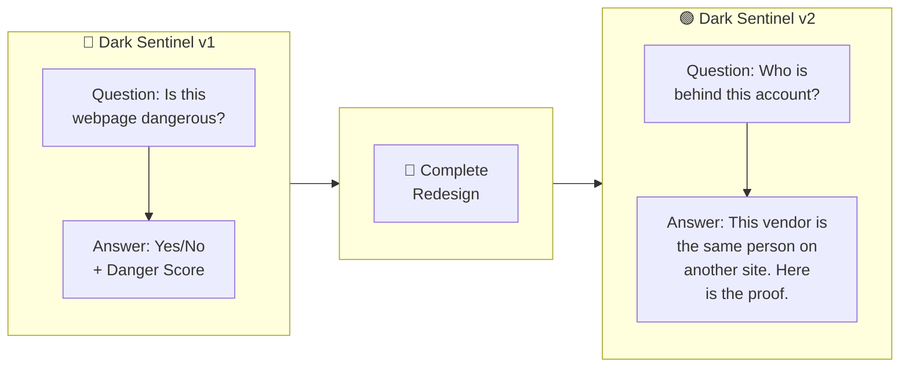

| | Version 1 | Version 2 |
|---|---|---|
| **What we look at** | Individual web pages | Individual *people* |
| **The question** | "Is this content a threat?" | "Who is this person? Where else have they been?" |
| **The output** | A danger score for a page | A full person profile with all linked accounts, evidence, and confidence |
| **How it runs** | One-time scan | Continuous autonomous monitoring |

---

## 5. 🏗️ How It Works — The Five Layers

Think of it like a factory assembly line. Raw material (dark web pages) enters at one end, and finished intelligence (linked actor profiles with evidence) comes out the other.

```mermaid
flowchart TD
    subgraph L1["🔭 Layer 1: COLLECTION<br/>Go out and gather information"]
        L1A["Visit dark web sites<br/>through Tor anonymously"]
        L1B["Download vendor profiles,<br/>forum posts, and<br/>encryption keys"]
        L1C["Lab hidden service for<br/>testing with a REAL<br/>Tor crawl"]
    end

    subgraph L2["🔬 Layer 2: EXTRACTION<br/>Pull out the important clues"]
        L2A["Find crypto wallets<br/>(Bitcoin, Ethereum,<br/>Monero, Litecoin)"]
        L2B["Find communication IDs<br/>(emails, Telegram,<br/>Jabber handles)"]
        L2C["Find & decode encryption<br/>keys (PGP fingerprints)"]
        L2D["Decode disguised usernames<br/>(Dr3adPirat3 → dreadpirate)"]
    end

    subgraph L3["🔎 Layer 3: RECONNAISSANCE<br/>Check for server mistakes"]
        L3A["Check if the server<br/>accidentally reveals<br/>its real location"]
        L3B["Compare server fingerprints<br/>with public internet<br/>(Shodan / Censys)"]
    end

    subgraph L4["🧩 Layer 4: LINKING<br/>Connect the dots"]
        L4A["Compare writing styles<br/>(stylometry)"]
        L4B["Compare active hours<br/>and behavior patterns"]
        L4C["Build a relationship<br/>graph connecting<br/>linked accounts"]
        L4D["Cluster personas<br/>into resolved actors"]
    end

    subgraph L5["📊 Layer 5: SCORING & OUTPUT<br/>Present the findings"]
        L5A["Calculate confidence<br/>(0% to 100%)"]
        L5B["Label: CONFIRMED,<br/>PROBABLE, POSSIBLE,<br/>or WEAK"]
        L5C["Dashboard, PDF reports,<br/>CSV/JSON exports"]
    end

    L1 --> L2 --> L3 --> L4 --> L5

    style L1 fill:#1a1a2e,color:#e0e0e0
    style L2 fill:#16213e,color:#e0e0e0
    style L3 fill:#0f3460,color:#e0e0e0
    style L4 fill:#533483,color:#e0e0e0
    style L5 fill:#e94560,color:#e0e0e0
```

### Layer by Layer — In Plain English

#### 🔭 Layer 1: Collection — "The Fieldwork"
> **Analogy**: Like a detective visiting crime scenes to collect evidence.

The system visits dark web marketplaces and forums through the Tor network. It reads vendor profiles, forum posts, and publicly visible information — at a responsible rate of only one request every 2 seconds per site. **It never hacks into anything.**

**NEW — Lab Hidden Service**: We built a practice dark web site (served over real Tor) that hosts our test data. This lets us prove the system works end-to-end over a real Tor circuit — not just reading files from a folder. The crawl takes 74 seconds across 33 requests, and every one of 424 text fields comes back identical to the offline test data.

#### 🔬 Layer 2: Extraction — "The Crime Lab"
> **Analogy**: Like forensic scientists finding fingerprints and DNA at a crime scene.

Extracts cryptocurrency wallet addresses, encryption key fingerprints, emails, Telegram handles, and decodes disguised usernames.

#### 🔎 Layer 3: Reconnaissance — "Checking for Unlocked Doors"
> **Analogy**: Like checking if a suspect accidentally left their real home address on a package.

The system passively checks for server misconfigurations that could reveal a site's real identity.

#### 🧩 Layer 4: Linking — "Connecting the Suspects"
> **Analogy**: Like a detective pinning photos on a corkboard and drawing strings between connected suspects.

Compares every account against every other using writing style, behavior patterns, and shared identifiers, then **clusters** linked accounts into resolved actor profiles.

#### 📊 Layer 5: Scoring & Output — "The Intelligence Report"
> **Analogy**: Like writing up a case file with all evidence and a recommendation.

All evidence is combined into a single confidence score with full transparency — every score comes with an explanation of *why*.

---

## 6. 🔑 The Four Clues We Look For

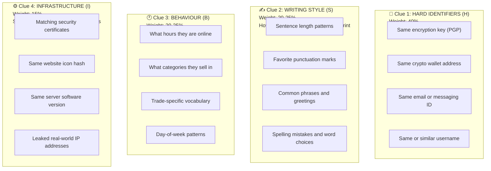

| Clue | Weight | Why This Much? |
|---|---|---|
| 🔑 **Hard Identifiers (H)** | **40%** | Strongest evidence. A shared PGP key is like finding the same passport at two crime scenes. |
| ✍️ **Writing Style (S)** | **20–25%** | Reliable but not perfect alone. Two people *can* write similarly. |
| 🕐 **Behaviour (B)** | **20–25%** | Your sleep schedule and habits are hard to fake consistently. |
| ⚙️ **Infrastructure (I)** | **15%** | Useful when available, but many vendors don't run their own servers. |

---

## 7. 📐 How We Calculate a Confidence Score

The overall confidence score combines the four clues:

```
Confidence = (40% × Hard Identifiers) + (25% × Writing Style) 
           + (20% × Behaviour)        + (15% × Infrastructure)
```

The result maps to a confidence label:


> [!IMPORTANT]
> **A score is never shown without its reasons.** If the system says two accounts are linked with 0.92, it explains exactly why: *"Same PGP fingerprint CE58..., writing similarity 0.86, 84% posting-hour overlap."* Courts need evidence, not numbers.

---

## 8. 📋 A Worked Example — Catching a Rebranded Vendor

### The Scenario

**Market Alpha** gets shut down. Weeks later, **Market Gamma** appears. Some vendors look familiar under new names.

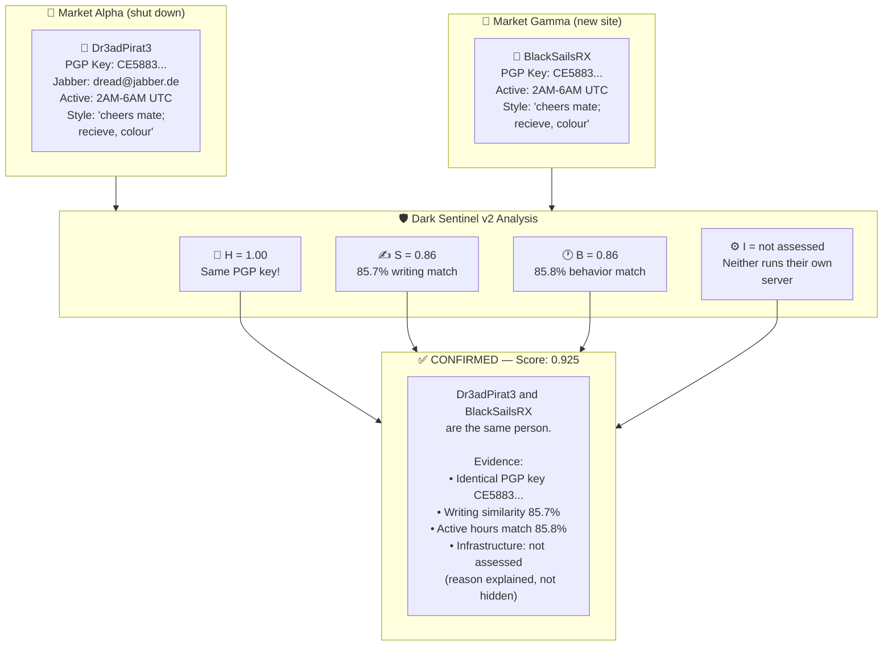

### The Third Account — Cluster Resolution

The same real person also posted on **Forum Beta** as **Dread_P1rate**. This third account shares a jabber ID with Dr3adPirat3 but shares *nothing* with BlackSailsRX directly. The system resolves this through **cluster closure** — since both are connected through Dr3adPirat3, all three are grouped into one actor.

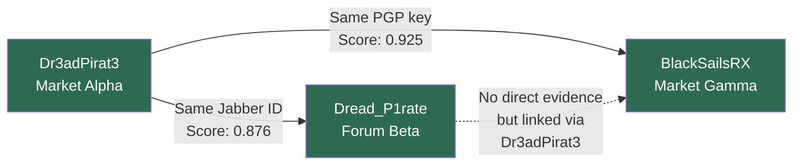

### Difficult Cases the System Handles Correctly

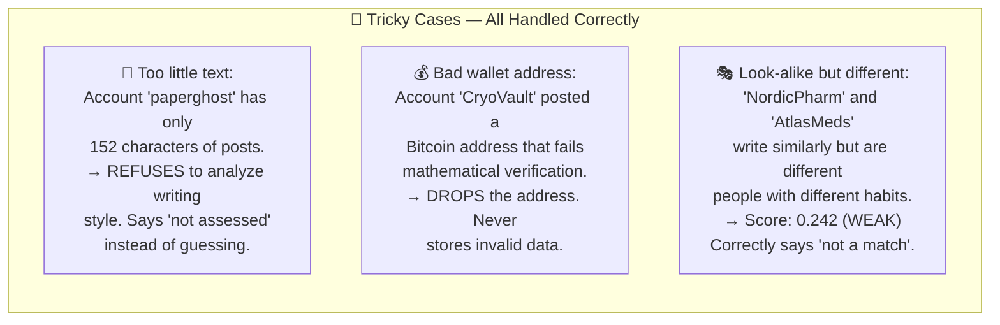

---

## 9. 🧪 The Live Paste Feature — "Prove It's Not Canned"

A common question at a demo: *"Are these just pre-loaded results?"*

The **`/analyze`** page answers this definitively. Anyone can paste text the system has never seen, and it gets analyzed live against every stored writing profile.

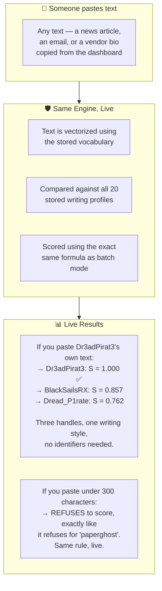

> [!TIP]
> **The vocabulary is never re-fitted on pasted text.** It is transformed against the existing trained model, so the paste cannot move anyone else's score. This is a mathematical guarantee, not a promise.

---

## 10. 📊 The Buyer Trust Analysis — And Why We Don't Use It

This is one of the most important design decisions in the project, and it demonstrates intellectual honesty.

Dark web marketplaces publish **buyer reviews**. Two vendors reviewed by the same buyers *might* be the same person. The tempting move: add this to the score.

**We measured it first. It's worse than a coin flip.**

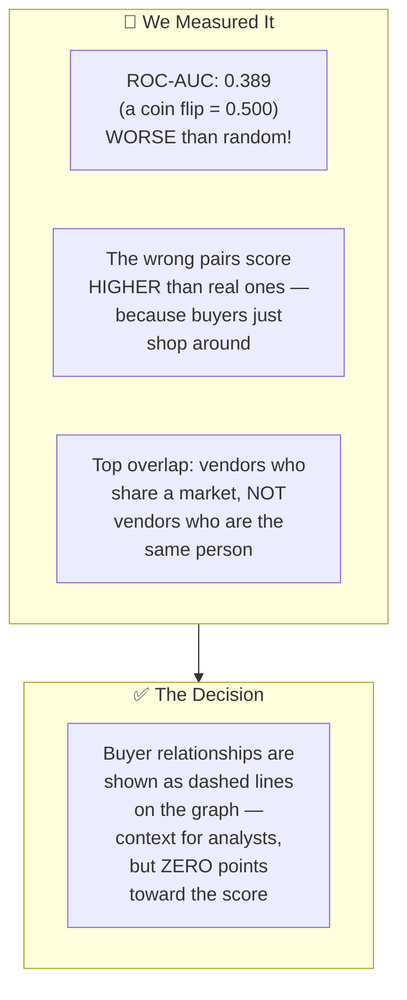

> [!IMPORTANT]
> **We built the obvious feature, measured it, proved it hurts, and turned it off.** This is significantly more valuable than blindly including every signal. The measurement is re-runnable: `python -m link.trust --measure`

---

## 11. 🔒 Safety Measures & Ethical Guardrails

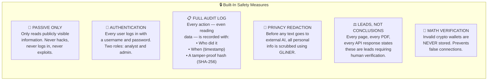

### Role-Based Access

| Role | Can Do | Cannot Do |
|---|---|---|
| **Analyst** | View actors, analyze text, export reports | Start pipeline runs, view audit log |
| **Admin** | Everything an analyst can do, PLUS start pipelines and view audit log | — |

> [!CAUTION]
> **This tool is for authorized law enforcement, national security, and academic research ONLY.** Every scan records the operator's identity. Misuse is traceable.

---

## 12. ✅ The Complete System — Everything That's Built

**All 7 phases are complete.** Here is what has been built:

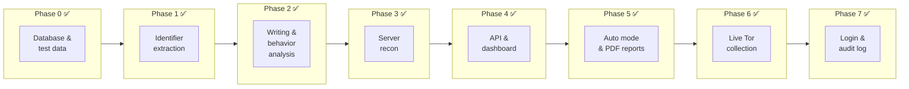

### Detailed Phase Status

| Phase | What It Does | Status | Key Numbers |
|---|---|---|---|
| **Phase 0** | Database schema, 20 test accounts across 3 fake marketplaces, ground truth answer key | ✅ Complete | 20 personas, 14 actors, 200 posts |
| **Phase 1** | Extracts wallets, emails, PGP keys, Telegram handles; decodes leet-speak usernames | ✅ Complete | 100% extraction recall, zero false positives |
| **Phase 2** | Writing style analysis, behavior profiling, relationship graph, pairwise scoring | ✅ Complete | 100% precision, +0.508 separation margin |
| **Phase 3** | Server fingerprinting, clearnet correlation, misconfiguration scoring | ✅ Complete | All planted server leaks found |
| **Phase 4** | Full REST API (9 routers), interactive dashboard (8 pages), actor clustering | ✅ Complete | 9 API routers, 8 dashboard pages |
| **Phase 5** | Autonomous scheduler, PDF case reports, full Docker Compose deployment | ✅ Complete | PDF with cover, methodology, evidence, legal notes |
| **Phase 6** | Live collection over real Tor circuits, lab hidden service, collector verification | ✅ Complete | 33 requests, 74s, 424 fields byte-identical |
| **Phase 7** | JWT authentication, role-based access (analyst/admin), full audit log on every action | ✅ Complete | Every read and write is logged |

### The Complete File Map

```
dark-sentinel-v2/
├── api/                     ← REST API (FastAPI)
│   ├── main.py              ← Application entry point, CORS, health check
│   ├── auth.py              ← JWT login, role enforcement, audit logging
│   ├── schemas.py           ← Data structures for API responses
│   └── routers/
│       ├── actors.py        ← GET /actors, GET /actors/{id}
│       ├── analyze.py       ← POST /analyze (live text scoring)
│       ├── graph.py         ← GET /graph (network visualization data)
│       ├── timeline.py      ← GET /timeline (activity over time)
│       ├── recon.py         ← GET /recon/{onion} (infrastructure report)
│       ├── scan.py          ← POST /scan (start analysis job)
│       ├── export.py        ← GET /export (CSV, JSON, PDF)
│       ├── audit.py         ← GET /audit (who looked at what)
│       └── auth.py          ← POST /auth/login, POST /auth/logout
│
├── collectors/              ← Live data collection over Tor
│   ├── base.py              ← Shared crawl loop, rate limiting, safety rules
│   ├── forum_collector.py   ← Forum thread/post parser
│   ├── market_collector.py  ← Marketplace vendor page parser
│   └── verify.py            ← Fidelity check against offline corpus
│
├── extract/                 ← Forensic data extraction
│   ├── identifiers.py       ← Wallet, email, PGP extraction with checksums
│   ├── normalize.py         ← Leet-speak decode (Dr3adPirat3 → dreadpirate)
│   ├── pgp.py               ← OpenPGP key block parser
│   └── gliner_extract.py    ← AI-based entity extraction & privacy redaction
│
├── recon/                   ← Server reconnaissance
│   ├── fingerprint.py       ← Passive fingerprinting (headers, favicons, certs)
│   ├── correlate.py         ← Match fingerprints against clearnet records
│   └── tor.py               ← Safe Tor connection manager
│
├── link/                    ← Attribution linking engine
│   ├── stylometry.py        ← Writing style analysis (TF-IDF writeprints)
│   ├── behaviour.py         ← Posting time & behavior profiling
│   ├── resolve.py           ← Pairwise evidence scoring
│   ├── cluster.py           ← Group personas into resolved actors
│   ├── graph.py             ← Network graph analysis
│   ├── infra.py             ← Infrastructure attribution logic
│   ├── trust.py             ← Buyer overlap analysis (measured, not used)
│   └── leads.py             ← Clearnet leads from recon findings
│
├── score/                   ← Confidence scoring
│   └── attribution.py       ← The formula: A = 0.40H + 0.25S + 0.20B + 0.15I
│
├── export/                  ← Report generation
│   └── report.py            ← PDF case reports (ReportLab)
│
├── lab/                     ← Practice dark web target
│   ├── app.py               ← Fake marketplace served over Tor
│   ├── Dockerfile           ← Lab web server container
│   └── Dockerfile.tor       ← Lab Tor hidden service container
│
├── ui/                      ← Dashboard (Next.js 14 + TypeScript)
│   └── app/
│       ├── login/           ← Sign-in page
│       ├── actors/          ← Actor list table + detail dossier
│       ├── graph/           ← Interactive force-directed link graph
│       ├── analyze/         ← Live text paste analysis
│       ├── timeline/        ← Activity timeline chart
│       ├── export/          ← Report download page
│       └── audit/           ← Audit log viewer (admin only)
│
├── scripts/                 ← Pipeline & utility scripts
│   ├── scheduler.py         ← Autonomous monitoring daemon
│   ├── evaluate.py          ← Precision/recall benchmark
│   ├── ingest.py            ← Data ingestion pipeline
│   ├── collect.py           ← Live Tor collection runner
│   ├── load_fixtures.py     ← Seed demo corpus
│   └── seed_users.py        ← Create demo user accounts
│
├── tests/                   ← 414 automated tests
├── fixtures/                ← Synthetic test data with answer key
├── Dockerfile               ← API container image
├── docker-compose.yml       ← Full-stack deployment (6 services)
├── .github/workflows/ci.yml ← CI/CD pipeline (pytest + browser checks)
├── schema_v2.sql            ← Database migrations (idempotent)
└── DEMO.md                  ← 7-minute demo cue card
```

---

## 13. 🖥️ How the Dashboard Looks


The dashboard has **8 pages**, each serving a specific investigative purpose:

### 🖼️ Visual Interface Overview

````carousel

<!-- slide -->

<!-- slide -->

<!-- slide -->

<!-- slide -->

````


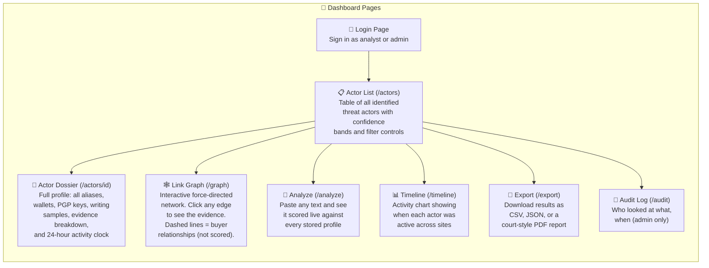

### Key UI Components

| Component | What It Shows |
|---|---|
| **BandPill** | Color-coded label: 🟢 CONFIRMED, 🟡 PROBABLE, 🟠 POSSIBLE, 🔴 WEAK |
| **ComponentBreakdown** | The four scores (H, S, B, I) with "not assessed" shown as an orange note instead of a misleading zero |
| **EvidenceList** | Plain-language citations: *"same PGP fingerprint CE5883..."*, *"writeprint cosine 0.857"* |
| **ForceGraph** | Interactive D3 force-directed graph — nodes are personas, edges are links, thickness = confidence |
| **RefusalNotice** | Explains *why* a score was not given (too little text, invalid wallet, etc.) |

---

## 14. 🐳 One-Command Deployment

The entire system deploys with two commands:

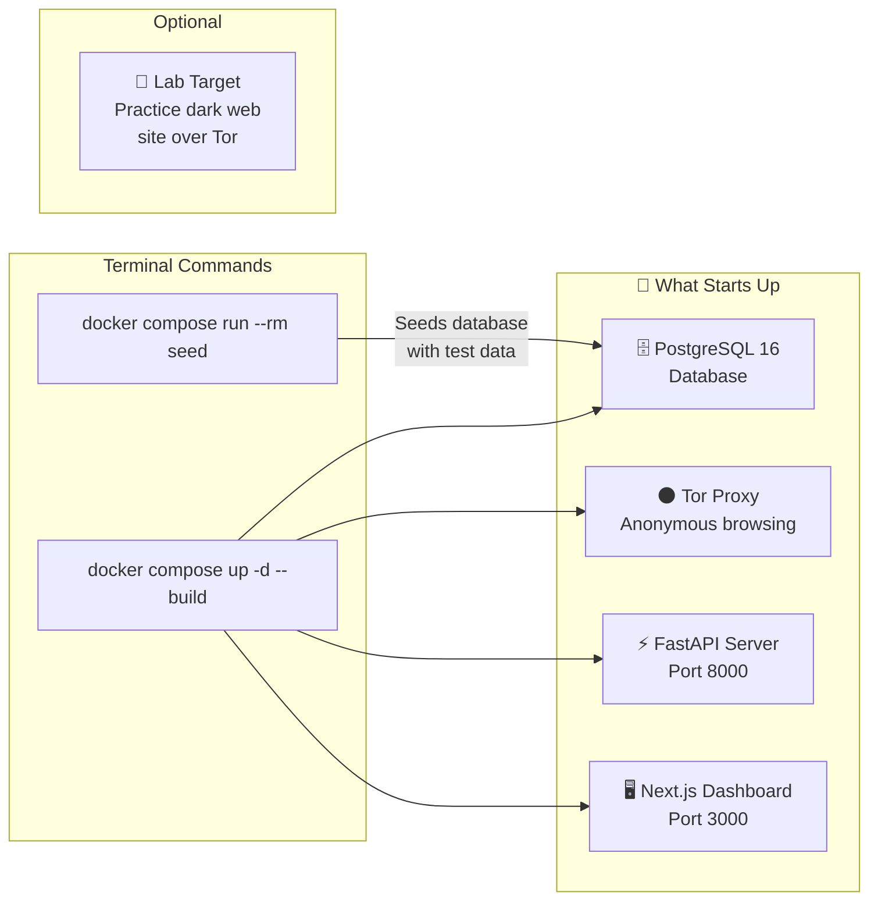

| Service | Purpose | Port |
|---|---|---|
| **db** | PostgreSQL database storing all actors, identifiers, and evidence | 5432 |
| **tor** | Tor SOCKS5 proxy for anonymous dark web access | 9050 |
| **api** | FastAPI backend serving all data and running the pipeline | 8000 |
| **ui** | Next.js frontend dashboard | 3000 |
| **lab** *(optional)* | Practice target — a fake marketplace served over a real Tor hidden service | — |
| **seed** *(one-shot)* | Applies database schema, loads test data, runs the full pipeline | — |

### Autonomous Mode

The scheduler is *not* started automatically (a tool that crawls the dark web just because someone ran `docker compose up` is not safe). Start it deliberately:

```
docker compose exec api python scripts/scheduler.py --start --interval 15m
```

---

## 15. 📈 How Accurate Is It?

We tested against **20 fake dark web accounts** spread across **3 websites** with a known answer key.

### The Numbers

| Metric | Value | What It Means |
|---|---|---|
| **Precision** | **100%** | Never falsely linked two different people. If it says "match," it's right. |
| **Recall (direct)** | **75%** (6/8) | Found 6 of 8 pairs directly. The other 2 require cluster resolution. |
| **Recall (with clusters)** | **100%** (8/8) | All 8 pairs found when including indirect links through shared connections. |
| **Safety Margin** | **+0.508** | Massive gap between weakest real match (0.853) and strongest false match (0.345). |
| **False Positives** | **0** | Zero wrong connections. |
| **Automated Tests** | **414 passed** | Extensive test coverage across all modules. |
| **Browser Checks** | **49 passed** | UI tested in a real browser for accessibility and correctness. |

### Things the System Correctly Refused to Do

- ❌ **Refused** to analyze writing style for an account with only 152 characters (too little to be meaningful)
- ❌ **Refused** to store a Bitcoin address that failed checksum validation
- ❌ **Refused** to use buyer overlap as a scoring signal (measured ROC-AUC: 0.389, worse than a coin flip)
- ❌ **Correctly rejected** two accounts that looked similar but were genuinely different people

### The Site-Broadcast Test — Arguing Against Ourselves

We built the "obvious" shortcut (give every vendor their marketplace's server fingerprint) and measured what it costs:

| | Without Shortcut | With Shortcut |
|---|---|---|
| Separation margin | **+0.508** | +0.287 (43% worse) |
| CONFIRMED pairs | 6/8 | **4/8** (lost two real matches) |
| Worst effect | — | Manufactures confidence about the one persona we correctly refuse to score |

> *"So the infrastructure term stays unmeasured. That's a result, not a gap."*

---

## 16. 🔧 Tech Stack at a Glance

| Component | Technology | Purpose |
|---|---|---|
| **Language** | Python 3.11 | Core platform |
| **Web Framework** | FastAPI | Backend API |
| **Database** | PostgreSQL 16 | All data storage |
| **ORM** | SQLAlchemy 2.x | Database access layer |
| **ML/NLP** | scikit-learn, GLiNER | Writing analysis, entity extraction |
| **Network Analysis** | NetworkX | Relationship graphs |
| **Dark Web Access** | Tor + PySocks | Anonymous .onion browsing |
| **PDF Reports** | ReportLab | Court-style case documents |
| **Authentication** | JWT (PyJWT) + bcrypt | Secure login |
| **Frontend** | Next.js 14, TypeScript | Dashboard |
| **State Management** | Zustand | Frontend state |
| **Data Tables** | TanStack React Table | Sortable/filterable tables |
| **Charts** | Recharts | Timeline visualizations |
| **Graph Visualization** | D3.js (force-directed) | Interactive link graphs |
| **Containerization** | Docker Compose | One-command deployment |
| **CI/CD** | GitHub Actions | Automated testing on every commit |
| **Testing** | pytest (414 tests) | Backend quality |
| **Browser Testing** | Playwright | Frontend quality (49 checks) |

---

## 17. 📚 Glossary — Terms in Plain English

| Term | Simple Explanation |
|---|---|
| **Actor** | The real person behind one or more anonymous accounts |
| **Persona** | One anonymous account/username on one specific website |
| **Attribution** | Figuring out which anonymous accounts belong to the same real person |
| **PGP Key** | A digital "passport" used for encryption. Each has a unique fingerprint |
| **Cryptocurrency Wallet** | A digital "bank account number" for Bitcoin, Ethereum, etc. |
| **Stylometry** | Analyzing writing style to identify an author — like handwriting analysis for typed text |
| **Leet Speak** | Replacing letters with numbers to disguise a username (e.g., `Dr3adPirat3` = `DreadPirate`) |
| **Tor / Onion Routing** | Technology making internet traffic anonymous by routing through multiple computers |
| **OPSEC** | Operational Security — practices to stay anonymous. When OPSEC fails, people get caught |
| **Clearnet** | The regular internet (not the dark web) |
| **Favicon** | The tiny icon in a browser tab. Its digital fingerprint can link a hidden site to a regular one |
| **ETag** | A technical tag on web files. Matching ETags may indicate the same machine |
| **Confidence Band** | A label (CONFIRMED / PROBABLE / POSSIBLE / WEAK) indicating certainty of a link |
| **False Positive** | Incorrectly saying two accounts are the same person (we have zero) |
| **Noisy-OR** | A formula for combining clues — having 3 pieces of evidence is better than 1, but doesn't over-count |
| **Cluster Resolution** | Finding that A and C are the same person because both link to B |
| **Writeprint** | A mathematical "fingerprint" of someone's writing style |
| **JWT** | JSON Web Token — a secure way to prove you're logged in |
| **ROC-AUC** | A measure of how good a signal is at telling two things apart (0.5 = coin flip, 1.0 = perfect) |
| **CI/CD** | Continuous Integration / Continuous Deployment — automated testing on every code change |

---

> **Document Version**: 2.0 (Updated September 2026 — all 7 phases complete)  
> **Project**: Dark Sentinel v2 — SIH Hackathon  
> **Tests**: 414 passed, 49 browser checks  
> **Classification**: Authorized Investigative Use Only
