# 🛡️ Dark Sentinel v2 — Project Documentation

## Finding the People Behind the Masks on the Dark Web

---

## 📖 Table of Contents

1. [What Is This Project?](#1--what-is-this-project)
2. [Why Does This Matter? — Real Cases That Inspired Us](#2--why-does-this-matter--real-cases-that-inspired-us)
3. [How Does the Dark Web Work? — A Simple Explanation](#3--how-does-the-dark-web-work--a-simple-explanation)
4. [What Changed from Version 1?](#4--what-changed-from-version-1)
5. [How Dark Sentinel v2 Works — The Five Layers](#5--how-dark-sentinel-v2-works--the-five-layers)
6. [The Four Clues We Look For](#6--the-four-clues-we-look-for)
7. [How We Calculate a Confidence Score](#7--how-we-calculate-a-confidence-score)
8. [A Worked Example — Catching a Rebranded Vendor](#8--a-worked-example--catching-a-rebranded-vendor)
9. [Safety Measures & Ethical Guardrails](#9--safety-measures--ethical-guardrails)
10. [What We Have Built So Far](#10--what-we-have-built-so-far)
11. [What Still Needs to Be Built](#11--what-still-needs-to-be-built)
12. [How Accurate Is It?](#12--how-accurate-is-it)
13. [Tech Stack at a Glance](#13--tech-stack-at-a-glance)
14. [Glossary — Terms in Plain English](#14--glossary--terms-in-plain-english)

---

## 1. 🎯 What Is This Project?

### The One-Line Answer

> **Dark Sentinel v2 finds the real person behind anonymous dark web accounts — even when they change their name, move to a different website, or try to hide.**

### The Detective Analogy

Imagine a detective investigating a string of burglaries across different cities. The burglar uses a different alias in each city, wears different disguises, and works with different fences. But the detective notices patterns:

- The burglar always uses the **same lock-picking tools** (like reusing a cryptographic key)
- The burglar always **writes ransom notes with the same peculiar grammar** (like writing style analysis)
- The burglar always **works between 2 AM and 6 AM** (like posting-time patterns)
- The burglar accidentally left a **home address on a receipt at one crime scene** (like a server misconfiguration leaking a real IP address)

**Dark Sentinel v2 is that detective, but for the internet's dark web.** It collects these digital "fingerprints" from anonymous accounts across multiple dark web sites and figures out which accounts belong to the same real person.

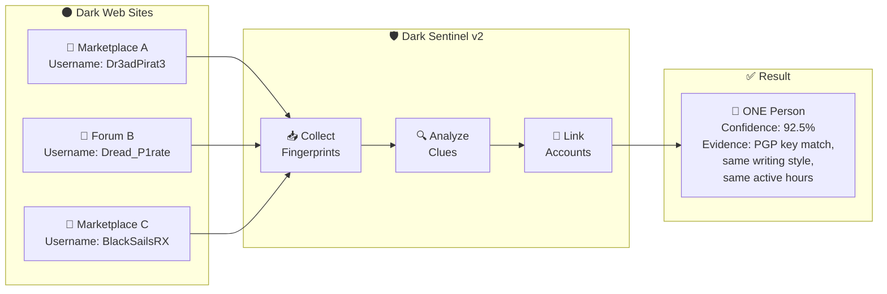

---

## 2. 🔍 Why Does This Matter? — Real Cases That Inspired Us

Criminals on the dark web believe they are invisible behind the Tor network. History has proven them wrong — not because Tor's technology failed, but because **humans make mistakes**. Here are the real-world cases that inspired each part of Dark Sentinel v2:

### 🏴‍☠️ Case 1: Silk Road — The Biggest Online Black Market

**Criminal**: Ross Ulbricht, operating as "Dread Pirate Roberts"

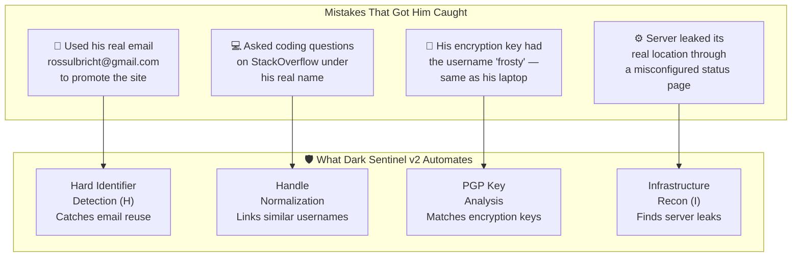

### 🏴 Case 2: AlphaBay — The Silk Road's Successor

**Criminal**: Alexandre Cazes, operating as "Alpha02"

| Mistake He Made | How Dark Sentinel v2 Catches This |
|---|---|
| Server welcome emails contained his personal email `pimp_alex_91@hotmail.com` in hidden technical headers | **Email extraction** from all collected text |
| Used the same username "Alpha02" on regular web forums and dark web sites | **Handle matching** across platforms |
| Received cryptocurrency payments to wallets linked to his real identity | **Wallet address tracking** with mathematical verification |

### 🏴 Case 3: Hansa Market & Others

When one marketplace gets shut down, vendors **migrate** to a new one under a new name. This is exactly what Dark Sentinel v2 is designed to detect — the same person appearing under different names on different sites.

---

## 3. 🌐 How Does the Dark Web Work? — A Simple Explanation

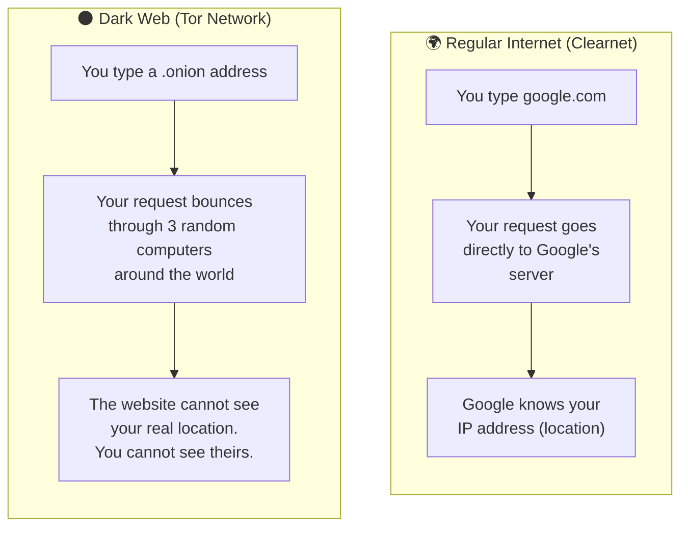

| Term | What It Means |
|---|---|
| **Tor** | A free tool that makes internet browsing anonymous by routing traffic through multiple computers worldwide |
| **.onion site** | A website that only exists on the Tor network — like a hidden address that normal browsers can't find |
| **Marketplace** | A dark web shopping site where vendors sell goods (many of them illegal) |
| **Forum** | A dark web discussion board where people share information |
| **Handle / Username** | The fake name someone uses on a website |

> **Key Insight**: The Tor network hides *where* you are, but it cannot hide *who* you are if you leave clues in what you write and share.

---

## 4. 🔄 What Changed from Version 1?

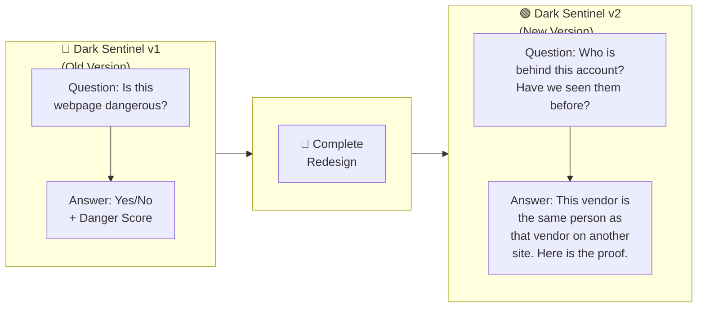

| What Changed | Version 1 | Version 2 |
|---|---|---|
| **What we look at** | Individual web pages | Individual *people* (actors) |
| **The question we answer** | "Is this content a threat?" | "Who is this person? Where else have they been?" |
| **The output** | A danger score for a page | A profile of a person — with all their accounts, wallets, and writing patterns linked together |
| **How it works** | One-time scan | Continuous monitoring, building a database over time |

---

## 5. 🏗️ How Dark Sentinel v2 Works — The Five Layers

Think of it like a factory assembly line. Raw material (dark web pages) enters at one end, and finished intelligence (linked actor profiles with evidence) comes out the other end.

```mermaid
flowchart TD
    subgraph L1["🔭 Layer 1: COLLECTION<br/>Go out and gather information"]
        L1A["Visit dark web<br/>marketplaces and forums<br/>through Tor"]
        L1B["Download vendor profiles,<br/>forum posts, and<br/>public encryption keys"]
    end

    subgraph L2["🔬 Layer 2: EXTRACTION<br/>Pull out the important clues"]
        L2A["Find crypto wallets<br/>(Bitcoin, Ethereum,<br/>Monero addresses)"]
        L2B["Find communication IDs<br/>(emails, Telegram,<br/>Jabber handles)"]
        L2C["Find & decode encryption<br/>keys (PGP fingerprints)"]
        L2D["Decode disguised usernames<br/>(Dr3adPirat3 → dreadpirate)"]
    end

    subgraph L3["🔎 Layer 3: RECONNAISSANCE<br/>Check for server mistakes"]
        L3A["Check if the dark web<br/>server accidentally<br/>reveals its real location"]
        L3B["Compare server fingerprints<br/>(icons, certificates)<br/>with public internet records"]
    end

    subgraph L4["🧩 Layer 4: LINKING<br/>Connect the dots"]
        L4A["Compare writing styles<br/>between accounts<br/>(stylometry)"]
        L4B["Compare active hours<br/>and behavior patterns"]
        L4C["Build a relationship<br/>graph connecting<br/>linked accounts"]
    end

    subgraph L5["📊 Layer 5: SCORING & OUTPUT<br/>Present the findings"]
        L5A["Calculate a confidence<br/>score (0% to 100%)"]
        L5B["Label: CONFIRMED,<br/>PROBABLE, POSSIBLE,<br/>or WEAK"]
        L5C["Show everything on<br/>a dashboard with<br/>full evidence trails"]
    end

    L1 --> L2 --> L3 --> L4 --> L5

    style L1 fill:#1a1a2e,color:#e0e0e0
    style L2 fill:#16213e,color:#e0e0e0
    style L3 fill:#0f3460,color:#e0e0e0
    style L4 fill:#533483,color:#e0e0e0
    style L5 fill:#e94560,color:#e0e0e0
```

### Layer by Layer — In Plain English

#### 🔭 Layer 1: Collection — "The Fieldwork"
> **Analogy**: Like a detective visiting crime scenes and collecting physical evidence.

The system visits dark web marketplaces and forums through the Tor network. It reads vendor profiles, forum posts, and publicly available information. It never hacks into anything — it only reads what is publicly visible, just like anyone browsing the site would see.

#### 🔬 Layer 2: Extraction — "The Crime Lab"
> **Analogy**: Like forensic scientists examining evidence under a microscope to find fingerprints, DNA, and trace evidence.

From the raw text collected, the system extracts valuable identifiers:
- **Cryptocurrency wallet addresses** (like bank account numbers for Bitcoin, Ethereum, etc.)
- **Encryption key fingerprints** (unique digital "passport numbers" for PGP keys)
- **Email and messaging IDs** (Telegram, Jabber/XMPP handles)
- **Username normalization** — decoding "leet speak" disguises (e.g., `Dr3adPirat3` → `dreadpirate`, `V3ct0rShop` → `vectorshop`)

> [!IMPORTANT]
> **Wallet Verification**: Every cryptocurrency address is mathematically verified. If someone writes a random string of characters that *looks* like a Bitcoin address but isn't one, the system rejects it. This prevents false connections.

#### 🔎 Layer 3: Reconnaissance — "Checking for Unlocked Doors"
> **Analogy**: Like checking if a suspect accidentally left their real home address on a package.

Dark web servers sometimes make mistakes. They might accidentally reveal:
- Their **real IP address** through a misconfigured status page
- A **security certificate** that mentions a regular website domain
- A **website icon** (favicon) that matches one on the regular internet
- **Server software details** that match a known regular website

The system only looks at information the server *already shows to everyone*. It never tries to break in.

#### 🧩 Layer 4: Linking — "Connecting the Suspects"
> **Analogy**: Like a detective pinning photos on a corkboard and drawing strings between connected suspects.

This is where the magic happens. The system compares every account against every other account using multiple methods:

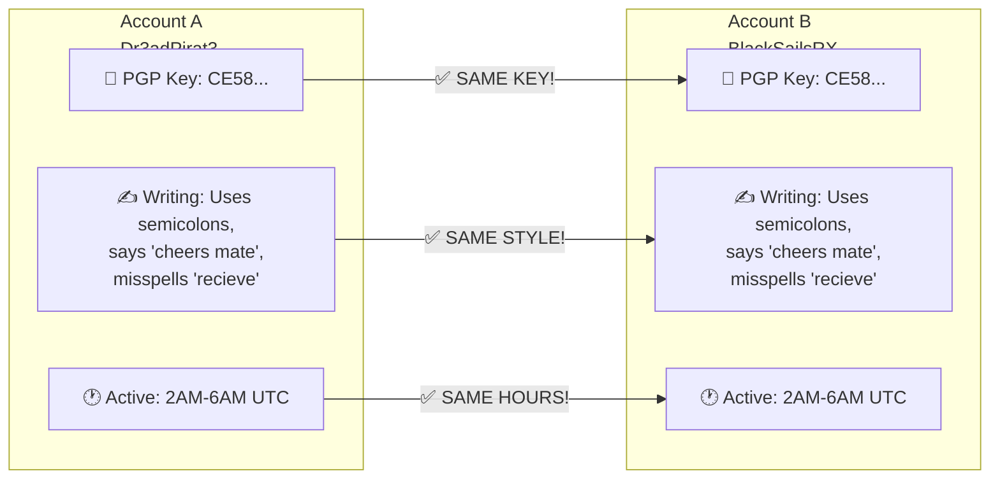

#### 📊 Layer 5: Scoring & Output — "The Intelligence Report"
> **Analogy**: Like a detective writing up a case file with all the evidence, a confidence assessment, and a clear recommendation.

All the evidence is combined into a single confidence score and presented to an analyst with full transparency — every score comes with an explanation of *why*.

---

## 6. 🔑 The Four Clues We Look For

Dark Sentinel v2 looks for four types of clues. Think of them as four different kinds of "fingerprints":

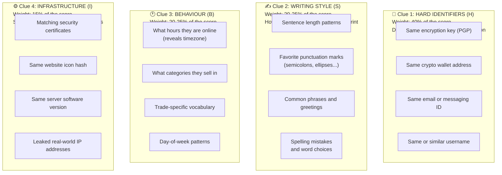

### Why These Specific Weights?

| Clue | Weight | Why This Much? |
|---|---|---|
| 🔑 **Hard Identifiers (H)** | **40%** | The strongest evidence. A shared PGP key is like finding the same person's passport at two crime scenes. |
| ✍️ **Writing Style (S)** | **20–25%** | Reliable but not perfect on its own. Two people *can* write similarly, so we never rely on this alone. |
| 🕐 **Behaviour (B)** | **20–25%** | Strong supporting evidence. Your sleep schedule and habits are hard to fake consistently. |
| ⚙️ **Infrastructure (I)** | **15%** | Useful when available, but many vendors don't run their own servers, so this clue isn't always applicable. |

---

## 7. 📐 How We Calculate a Confidence Score

### The Formula (Explained Simply)

The overall confidence score is calculated by combining the four clues:

```
Confidence = (40% × Hard Identifiers) + (25% × Writing Style) 
           + (20% × Behaviour)        + (15% × Infrastructure)
```

The result is a number between **0.0** (no match) and **1.0** (perfect match), which maps to a confidence label:

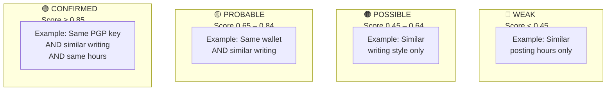

### Why We Show Our Work

> [!IMPORTANT]
> A score is never shown without its reasons. If the system says two accounts are linked with a score of 0.92, it will **always** explain exactly why — for example: *"Same PGP fingerprint CE58..., writing style similarity 0.86, 84% posting-hour overlap."*
>
> This is critical because in a real investigation, an analyst or a court needs to see the evidence, not just a number.

---

## 8. 📋 A Worked Example — Catching a Rebranded Vendor

Let's walk through a concrete example of how Dark Sentinel v2 connects two accounts.

### The Scenario

An illegal marketplace called **Market Alpha** gets shut down by law enforcement. A few weeks later, a new marketplace called **Market Gamma** appears. Some of the vendors on Market Gamma look suspiciously similar to vendors from Market Alpha — but they have completely different usernames.

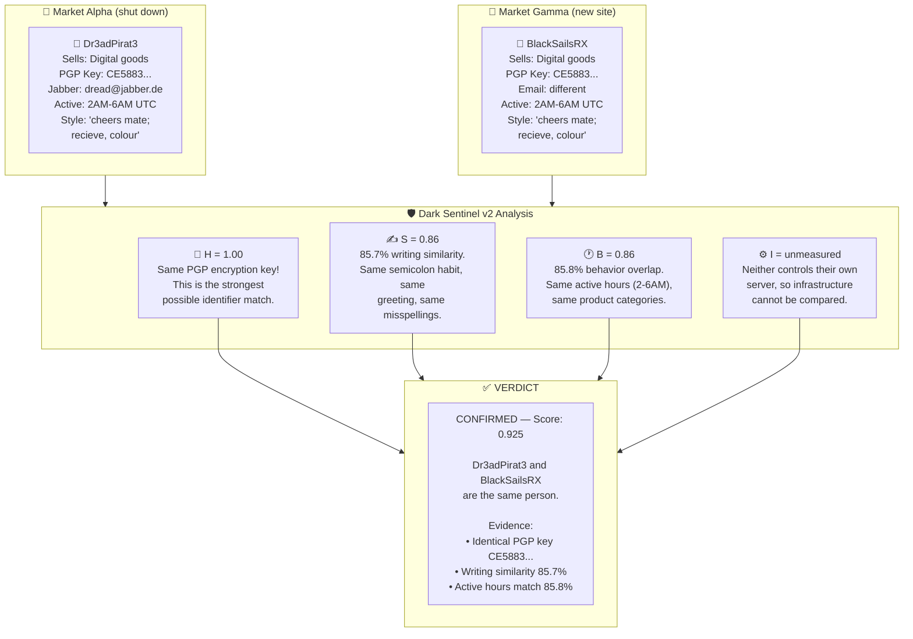

### What About Difficult Cases?

The system is designed to be **cautious**. Here is what happens when it doesn't have enough evidence:

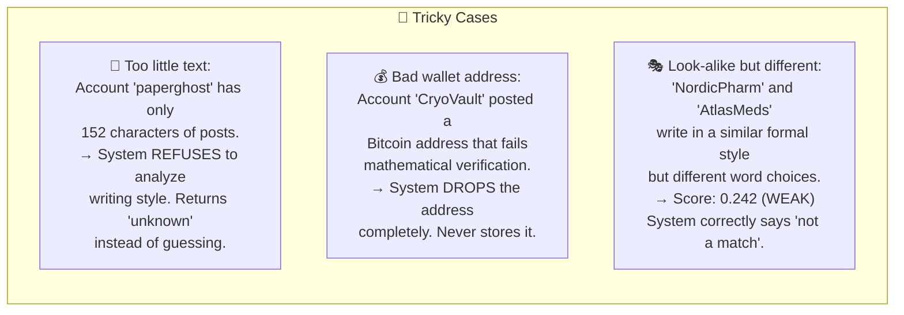

> [!TIP]
> **A tool that only says "yes" is a tool that's guessing.** Dark Sentinel v2 is designed to say "I don't know" or "not enough evidence" — which is actually more valuable to an investigator than a wrong answer.

---

## 9. 🔒 Safety Measures & Ethical Guardrails

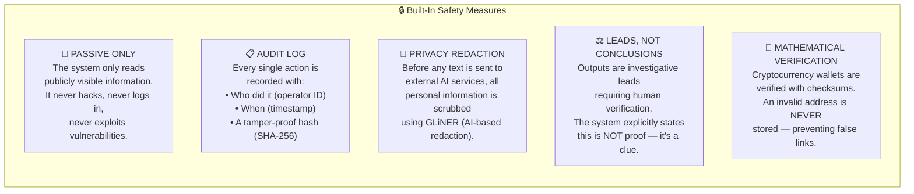

> [!CAUTION]
> **This tool is for authorized law enforcement, national security, and academic research ONLY.** Every scan records the operator's identity and creates a tamper-proof record. Misuse is traceable and auditable.

---

## 10. ✅ What We Have Built So Far

The project is organized into 5 phases. Here is the current status:

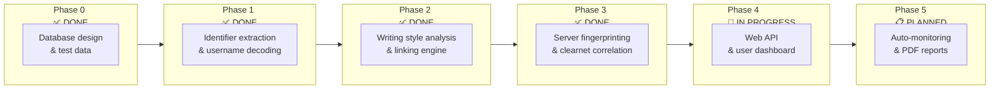

### Detailed Status

| Phase | What It Does | Status | Test Results |
|---|---|---|---|
| **Phase 0** | Created the database structure, generated 20 test accounts across 3 fake marketplaces with known answers | ✅ Complete | Database loads cleanly |
| **Phase 1** | Extracts wallets, emails, PGP keys, Telegram handles from text; decodes leet-speak usernames | ✅ Complete | 100% of findable identifiers detected, zero false positives |
| **Phase 2** | Analyzes writing styles, compares behavior patterns, builds a relationship graph between accounts | ✅ Complete | 100% precision — never incorrectly linked two different people |
| **Phase 3** | Checks dark web servers for accidental data leaks, compares against public internet records | ✅ Complete | Found all planted server leaks correctly |
| **Phase 4** | Web API to serve data to a user-friendly dashboard | 🔨 In Progress | — |
| **Phase 5** | Automatic continuous monitoring + PDF case report generation for investigations | 📋 Planned | — |

> **229 automated tests passing** — the core engine is thoroughly verified.

---

## 11. 🔨 What Still Needs to Be Built

### The API (Phase 4 — Backend)

The brain of the system works, but it needs a way to communicate with the user dashboard:

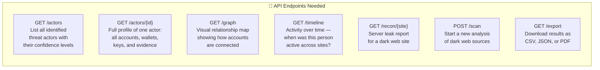

### The Dashboard (Phase 4 — Frontend)

The system needs a visual interface for investigators:

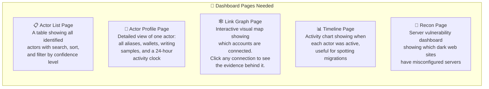

### Autonomous Mode (Phase 5)

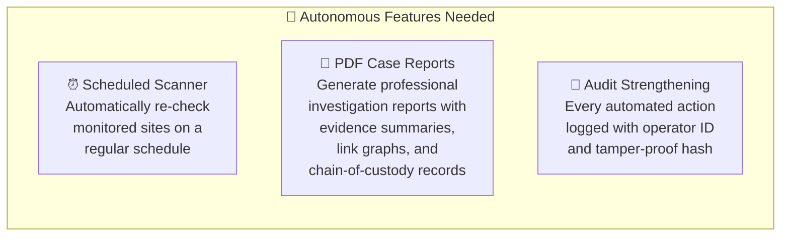

---

## 12. 📈 How Accurate Is It?

We tested the system against a scenario with **20 fake dark web accounts** spread across **3 websites**. We knew the right answers in advance (which accounts belong to the same person). Here are the results:

### The Numbers

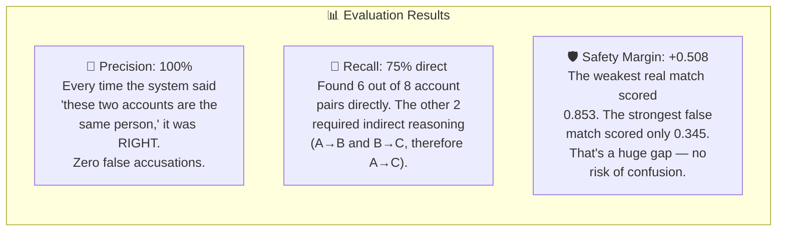

### What This Means in Plain English

| Metric | Value | What It Means |
|---|---|---|
| **Precision** | 100% | The system never falsely linked two different people. If it says "match," it's right. |
| **Recall** | 75% (direct), higher with clusters | It found most connections directly. Two pairs required chaining through a third account. |
| **Safety Margin** | +0.508 | There is a massive gap between the weakest real match and the strongest false match. The system won't confuse a coincidence with a real link. |
| **False Positives** | 0 | Zero wrong connections — critical for legal investigations |

### Things the System Correctly Refused to Do

- ❌ **Refused** to analyze writing style for an account with only 152 characters of text (too little to be meaningful)
- ❌ **Refused** to store a Bitcoin address that failed mathematical checksum validation
- ❌ **Correctly rejected** two accounts that looked similar but were genuinely different people (scored as WEAK)

---

## 13. 🔧 Tech Stack at a Glance

For those who want to know the technical details:

| Component | Technology | Purpose |
|---|---|---|
| **Programming Language** | Python 3.11+ | Core platform |
| **Web Framework** | FastAPI | Backend API server |
| **Database** | PostgreSQL 16 | Stores all actors, identifiers, links, and evidence |
| **Machine Learning** | scikit-learn, GLiNER | Writing style analysis and entity extraction |
| **Network Analysis** | NetworkX | Building and analyzing relationship graphs |
| **Dark Web Access** | Tor SOCKS5 Proxy | Safe, anonymous browsing of .onion sites |
| **Frontend** | Next.js 14, TypeScript | User-facing dashboard |
| **Containerization** | Docker Compose | One-command deployment |
| **Testing** | pytest (229 tests) | Automated quality assurance |

---

## 14. 📚 Glossary — Terms in Plain English

| Term | Simple Explanation |
|---|---|
| **Actor** | The real person behind one or more anonymous accounts |
| **Persona** | One anonymous account/username on one specific website |
| **Attribution** | The process of figuring out which anonymous accounts belong to the same real person |
| **PGP Key** | A digital "passport" used for encryption. Each key has a unique fingerprint, like a person's actual fingerprint |
| **Cryptocurrency Wallet** | A digital "bank account number" for Bitcoin, Ethereum, or other digital currencies |
| **Stylometry** | The science of analyzing writing style to identify an author — like handwriting analysis, but for typed text |
| **Leet Speak** | When people replace letters with numbers or symbols to disguise a username (e.g., `Dr3adPirat3` instead of `DreadPirate`) |
| **Tor / Onion Routing** | Technology that makes internet traffic anonymous by routing it through multiple computers |
| **OPSEC** | Operational Security — the practices someone uses to stay anonymous. When OPSEC fails, people get caught |
| **Clearnet** | The regular internet (not the dark web) — websites you access with a normal browser |
| **Favicon** | The tiny icon that appears in a browser tab. Its digital fingerprint can link a dark web site to a regular website |
| **ETag** | A technical tag a web server attaches to files. If two servers use the same ETag, they might be the same machine |
| **Confidence Band** | A label (CONFIRMED / PROBABLE / POSSIBLE / WEAK) indicating how sure we are about a link between accounts |
| **False Positive** | When the system incorrectly says two accounts are the same person (Dark Sentinel v2 has zero of these) |
| **Noisy-OR** | A mathematical formula used when combining multiple clues — ensures that having 3 pieces of evidence is better than having 1, but doesn't over-count them |

---

> **Document Version**: 1.0  
> **Last Updated**: September 2026  
> **Project**: Dark Sentinel v2 — SIH Hackathon  
> **Classification**: Authorized Investigative Use Only
